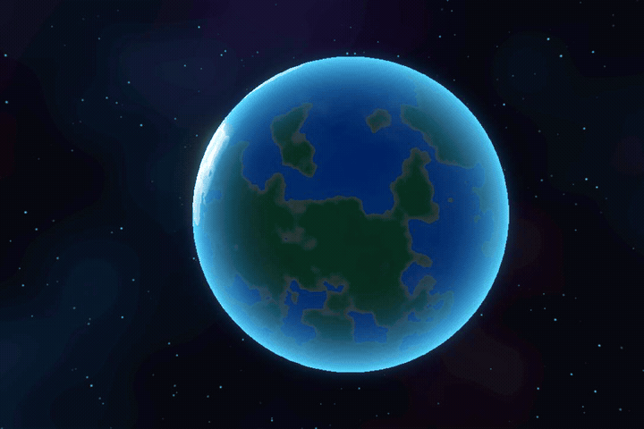

# CIVITUS: The Unmilky Way Home

A 3D procedural space survival and planetary exploration game built with Godot 4.7 GDScript and integrated with RevenueCat.

[](https://revenuecat-shipaton-2026.devpost.com/)
[](https://www.revenuecat.com/)
[](https://godotengine.org/)
[](https://developer.android.com/)
[](LICENSE)

---



---

## Overview

CIVITUS is an open-source 3D space survival and planetary exploration title. The player navigates an emergency escape capsule within an uncharted star cluster, lands on miniature spherical planets (Outer Wilds scale, R = 160m), collects resources, repairs ship life-support modules, explores diverse biomes, and restores the Hyperdrive core to return home.

The project incorporates an ethical, non-coercive freemium architecture powered by the RevenueCat SDK, featuring local offline entitlement caching and transparent purchasing tiers.

---

## Technical Architecture

### Procedural Cubed-Sphere Generation
- Continuous radial terrain synthesis utilizing 12,288 dynamic triangles per planetary body.
- Multi-octave simplex elevation modeling continental plates, oceanic basins (-14m), volcanic calderas, and mountain ranges (+24m).
- View-space perturbed normals for accurate PBR surface illumination invariant to camera orientation.

### Radial Planetary Physics
- Omnidirectional character physics oriented dynamically toward the planetary center of mass (r = 160m).
- Barometric scale height atmospheric attenuation model: P(h) = P0 * exp(-h / H).
- Procedural cloud systems with global trade wind advection and diurnal day/night cycles with Rayleigh scattering.

### Spaceship and Life Support Systems
- Interactive interior modules: Pilot Cockpit, Hyperdrive Plasma Core, StarMap Console, Oxygen Generator, Graviton Gimbal, and Storage Lockers.
- Diegetic first-person visor projection displaying barometric pressure, azimuth compass heading, and radiation dosimeter readings.
- Four-point body slot equipment system (Left Hand, Right Hand, Upper PLSS, Lower PLSS).

---

## RevenueCat Integration Architecture

```text
+-------------------------------------------------------------------------+
|                              CIVITUS CLIENT                             |
+-------------------------------------------------------------------------+
       |                                                   |
       v                                                   v
[RevenueCatManager]                                  [AdManager]
  - Native Purchases Singleton (Android)              - Rewarded Transmissions (+50 Coins)
  - Standalone Desktop / Offline State Machine        - Interstitials (100% Suppressed
       |                                                if 'no_ads' Entitlement Active)
       +--------------------+------------------------------+
                            |
                            v
       +-----------------------------------------+
       |         REVENUECAT DASHBOARD            |
       +-----------------------------------------+
       | Entitlements:                           |
       |  - 'no_ads'        -> Lifetime ad-free  |
       |  - 'planet_editor' -> Architect mode    |
       |  - 'full_game'     -> All VIP sectors   |
       | Products:                               |
       |  - civitus_no_ads       ($0.99 USD)     |
       |  - civitus_planet_editor ($1.99 USD)    |
       |  - civitus_full_game    ($2.99 USD)     |
       +-----------------------------------------+
```

Entitlements and license tokens are cached locally (`user://license.cfg`) to guarantee complete gameplay availability when running offline.

---

## Repository Structure

```text
├── assets/
│   ├── audio/             # Sound effects and ambient themes
│   ├── models/            # 3D assets (astronaut, ship, structures)
│   ├── shaders/           # GLSL shaders (atmosphere, fluid, terrain)
│   ├── sprites/           # Vector UI elements
│   └── textures/          # Material maps
├── docs/
│   ├── screenshots/       # Visual media and gameplay animations
│   └── icon_1024x1024.png
├── scenes/
│   ├── entities/          # Player, spaceship, fauna, flora
│   ├── screens/           # Main menu, loading, planet editor
│   ├── tools/             # Showcase tools and spectator scenes
│   ├── ui/                # HUD, visor, storage modals
│   └── world/             # Spherical world and planet generator
├── scripts/
│   ├── autoloads/         # Singletons (GameManager, RevenueCatManager, AdManager)
│   ├── entities/          # Gameplay actors and creature logic
│   ├── screens/           # UI logic
│   ├── systems/           # Crafting and inventory systems
│   └── world/             # Terrain and solar system algorithms
├── tests/                 # Headless TDD test suites (710 assertions)
├── tools/
│   ├── launchers/         # Cross-platform development launchers
│   └── *.py               # Procedural audio and asset generation scripts
├── project.godot          # Engine configuration
├── export_presets.cfg     # Build configurations
├── PRIVACY_POLICY.md      # Store compliance policy
└── LICENSE                # MIT License
```

---

## Automated Testing (TDD)

CIVITUS is tested via headless execution. 710 assertions validate orbital mechanics, radial gravity, inventory state machines, and monetization logic:

```bash
# Execute the primary physics, procedural generation, and AI suite
godot --headless --path . tests/test_civitus_core.tscn

# Execute the monetization and entitlement restoration suite
godot --headless --path . -s tests/test_monetization_and_editor.gd
```

---

## Building and Exporting

### Requirements
- Godot Engine 4.7.2+ Stable
- Android SDK / NDK (Build Tools 34+)
- OpenJDK 17

### Export Targets
```bash
# Android App Bundle (AAB):
godot --headless --export-release "Android AAB" "build/CIVITUS.aab"

# Universal APK:
godot --headless --export-release "Android APK (Universal y Emulador PC)" "build/CIVITUS_Universal.apk"

# ARM64-v8a APK:
godot --headless --export-release "Android APK (ARM64 Moderno)" "build/CIVITUS_ARM64.apk"

# armeabi-v7a APK:
godot --headless --export-release "Android APK (ARMv7 Gama Baja)" "build/CIVITUS_ARMv7.apk"
```

---

## RevenueCat Shipaton 2026 Submission

- Category: Next Gen Award (Student Track)
- Developer: Nicolas Buelvas
- Academic Affiliation: Systems Engineering, Universidad Icesi (Cali, Colombia)
- Institutional Email: nicolas.buelvas@correo.icesi.edu.co
- Devpost Profile: [nicolasbuelvas](https://devpost.com/nicolasbuelvas)

---

## License

This project is licensed under the [MIT License](LICENSE).
