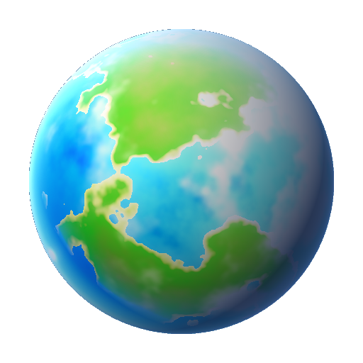

<div align="center">

  

  # CIVITUS
  ### *The Unmilky Way Home*

  **A 3D Procedural Space Survival & Exploration Experience**  
  *Built with Godot 4.7 & Powered by RevenueCat*

  [](https://revenuecat-shipaton-2026.devpost.com/)
  [](https://www.revenuecat.com/)
  [](https://godotengine.org/)
  [-3DDC84?style=for-the-badge&logo=android&logoColor=white)](https://developer.android.com/)
  [](LICENSE)

  <p align="center">
    <b>Submitted for the RevenueCat Shipaton 2026:</b><br />
    🎓 <b>Next Gen Award</b> (Active Student Category) &bull; 🏆 <b>Best Game Award</b> &bull; 🎨 <b>Design Award</b>
  </p>

</div>

---

## 🌌 Overview

**CIVITUS: The Unmilky Way Home** is an open-source 3D space survival and planetary exploration game built from the ground up in Godot 4.7 GDScript. Stranded in an uncharted star cluster, you pilot an emergency escape capsule, land on miniature dioramic spherical planets (Outer Wilds scale, $R=160\text{m}$), and must gather resources, repair damaged ship modules, study alien biomes, and restore your **Hyperdrive** to leap back home.

CIVITUS integrates **RevenueCat** to deliver a respectful, transparent freemium economy: explore freely, earn Luna Coins through exploration and optional diegetic orbital transmissions, or unlock cosmetic suits, the custom procedural **Planet Architect Editor**, and the full **Founder Edition**.

---

## ✨ Core Gameplay Systems

### 🪐 Procedural Spherical Diorama Planets
- **Cubed-Sphere Geometry:** Continuous radial terrain generation with 12,288 dynamic triangles, multi-octave simplex elevation, deep oceanic trenches ($-14\text{m}$), volcanic calderas, and mountain ridges ($+24\text{m}$).
- **Radial Gravity Physics:** Seamless omnidirectional character physics oriented towards the planetary center of mass ($r=160\text{m}$).
- **Realistic Atmospheric Scattering:** Physical KSP-style barometric formula $P(h) = P_0 \cdot e^{-h/H}$, dynamic cloud layer driven by planetary trade winds, and a full 20-minute diurnal solar cycle with Rayleigh reddening sunsets.
- **Extreme Planetary Types:** Habitable (Earth-like), Arid Desert, Volcanic Magma, Cryogenic Methane, Sulfuric Acid, and 100% Oceanic Water Worlds.

### 🐾 Dynamic Fauna & Flora Ecosystems
- **21 Procedural Creature Archetypes:** Across 3 locomotion domains:
  - *Terrestrial:* Grazers with horns, Strider bipeds, Armored Colossi, Hexapods, and burrowing Moles.
  - *Aquatic:* Reef rays, Bioluminescent jellyfish, Lantern anglers, and Leviathans.
  - *Aerial:* Aero-rays, Winged wyverns, and atmospheric Gas balloons.
- **Physical Interactions:** Pick up docil animals, carry them above your head, and rescue stranded aquatic creatures back into water bodies for symbiotic rewards.
- **21 Botanical Varieties:** Fractal trees, giant kelp forests, glowing cave fungi, carnivorous snappers with reactive 3D jaw colliders, and wind-blown tumbleweeds.

### 🚀 Modular Spaceship & Field Crafting (*Waste of Space* Inspired)
- **Interactive Cabin Modules:** Pilot Seat, Hyperdrive Plasma Core, StarMap Cartography Console, Oxygen Generator with rechargeable canisters, Graviton Gimbal, Storage Bins, and Cloning Medical Bay.
- **Astronaut Body Slots:** Physical gear strapping system with 4 tangible attachment points (Left Hand, Right Hand, Upper Back, Lower Back).
- **Diegetic First-Person HUD:** Curved aerospace visor frame projecting barometric pressure, azimuth compass, dosimeter radiation warnings, and suit headlamps.

### 🛸 Interplanetary Spaceflight
- Manual and autopilot orbital insertion into low parking orbit.
- Real-time Astronomical Unit (AU) interplanetary transit with fuel management and atmospheric retro-rocket re-entry physics.

---

## 💳 RevenueCat Monetization Architecture

CIVITUS is engineered with an ethical, non-intrusive monetization model that integrates the official **RevenueCat SDK**:

```
+-------------------------------------------------------------------------+
|                              CIVITUS CLIENT                             |
+-------------------------------------------------------------------------+
       |                                                   |
       v                                                   v
[RevenueCatManager]                                  [AdManager]
  - Public Key: test_HMpYIEhyCGifYHUCJfwbYiuBcsK       - Rewarded Transmissions (+50 Coins)
  - Native Purchases Singleton (Android)              - Interstitials (100% Suppressed
  - Dev/Offline Simulation Fallback                     if 'no_ads' Entitlement Active)
       |                                                   |
       +--------------------+------------------------------+
                            |
                            v
       +-----------------------------------------+
       |         REVENUECAT DASHBOARD            |
       +-----------------------------------------+
       | Entitlements:                           |
       |  - 'no_ads'        -> Lifetime ad-free  |
       |  - 'planet_editor' -> Architect mode    |
       |  - 'full_game'     -> All VIP sectors   |
       | Products:                               |
       |  - civitus_no_ads       ($0.99 USD)     |
       |  - civitus_planet_editor ($1.99 USD)    |
       |  - civitus_full_game    ($2.99 USD)     |
       +-----------------------------------------+
```

### In-App Purchases (RevenueCat Entitlements)
1. **`civitus_no_ads` ($0.99 USD):** Unlocks `no_ads` entitlement, permanently silencing all interstitial broadcasts.
2. **`civitus_planet_editor` ($1.99 USD):** Unlocks `planet_editor` entitlement, granting full access to procedural planet generation sliders, seed inputs, and atmosphere tweaking.
3. **`civitus_full_game` ($2.99 USD):** CIVITUS Founder Edition. Unlocks all entitlements (`full_game`, `no_ads`, `planet_editor`, and `deep_space_license`).

### Luna Coins Economy
- **Fair Earnability:** Complete expeditions and salvage ship modules to earn Luna Coins in-game.
- **Diegetic Orbital Transmissions (Rewarded Ads):** Optional 3-second deep-space communications that reward +50 Luna Coins without forcing unwanted interruptions.

---

## 📁 Repository Structure

```
├── assets/
│   ├── shaders/           # GLSL PBR shaders (atmosphere, fluids, sky, terrain)
│   ├── sprites/           # Vector UI buttons and HUD elements
│   ├── textures/          # Material maps and celestial icons
│   └── audio/             # Sound effects (propulsion, footsteps, airlock)
├── scenes/
│   ├── entities/          # 3D entities (astronaut, spaceship, fauna, flora)
│   ├── screens/           # Main menu, planet editor, loading screen
│   ├── ui/                # Diegetic HUD, visor frame, storage modal
│   └── world/             # Spherical cubed-sphere planet generator
├── scripts/
│   ├── autoloads/         # Singletons: GameManager, RevenueCatManager, AdManager, AudioManager
│   ├── entities/          # Character controllers, creature AI, spaceship mechanics
│   ├── screens/           # Menu navigators and star system cartography
│   ├── systems/           # Crafting recipes, body slots, save state serialization
│   └── world/             # Asynchronous terrain deformation & biome seeding
├── tests/                 # 600+ Headless TDD assertion suites
├── build/                 # Android release packages (AAB, ARM64, ARMv7, Universal)
├── project.godot          # Engine configuration & input map definitions
├── export_presets.cfg     # Android Gradle build & signature profiles
└── PRIVACY_POLICY.md      # Store compliance privacy policy
```

---

## 🧪 Automated Testing & Verification

CIVITUS is developed following strict Test-Driven Development (TDD) principles. Over **640 headless assertions** run without graphical display to validate mathematics, physics, and monetization:

```bash
# Run the complete core physics, procedural generation & AI suite (604 tests)
godot --headless --path . tests/test_civitus_core.tscn

# Run the complete gameplay, crafting & RevenueCat freemium loop (31 tests)
godot --headless --path . tests/test_gameplay_and_monetization_loop.tscn

# Verify asynchronous zero-freeze planetary generation across frames
godot --headless --path . tests/test_zero_freeze_loading.tscn

# Verify RevenueCat IAP entitlement unlocking & restore flow
godot --headless --path . -s tests/test_monetization_and_editor.gd
```

All suites execute cleanly with **0 errors, 0 failures, and exit code 0**.

---

## 🛠️ Building & Exporting

### Prerequisites
- **Godot Engine 4.7.2+ Stable**
- **Android SDK & NDK** with build tools 34+
- **OpenJDK 17**

### Compiling Android Packages
```bash
# 1. Android App Bundle (AAB) for Google Play & Galaxy Store release:
godot --headless --export-release "Android AAB" "build/CIVITUS.aab"

# 2. Universal APK (for emulators and test devices):
godot --headless --export-release "Android APK (Universal y Emulador PC)" "build/CIVITUS_Universal.apk"

# 3. ARM64-v8a APK (Modern 64-bit devices):
godot --headless --export-release "Android APK (ARM64 Moderno)" "build/CIVITUS_ARM64.apk"

# 4. armeabi-v7a APK (Low-spec 32-bit devices, target Moto C):
godot --headless --export-release "Android APK (ARMv7 Gama Baja)" "build/CIVITUS_ARMv7.apk"
```

---

## 🎓 Next Gen Award (Student Eligibility Verification)

This project is submitted to the **RevenueCat Shipaton 2026** under the **Next Gen Award** student category:

- **Lead Developer:** Nicolas Buelvas
- **Institution:** Universidad Icesi (Cali, Colombia)
- **Academic Program:** Systems Engineering (*Ingeniería de Sistemas*)
- **Institutional Email:** `nicolas.buelvas@correo.icesi.edu.co`
- **Devpost Profile:** [nicolasbuelvas](https://devpost.com/nicolasbuelvas)

---

## 📄 License

This project is licensed under the [MIT License](LICENSE) — feel free to explore, learn from, and expand upon the procedural generation and RevenueCat integration architecture.
